# DVWA Security Lab Report

**Author:** Muhammad Hayyan Khan
**Date:** March 2026
**Environment:** DVWA via Docker on localhost
**Scope:** Local machine only. DVWA was not exposed to the public internet.

## Table of Contents

1. [Environment Setup](#1-environment-setup)
2. [SQL Injection](#2-sql-injection)
3. [SQL Injection Blind](#3-sql-injection-blind)
4. [XSS Reflected](#4-xss-reflected)
5. [XSS Stored](#5-xss-stored)
6. [XSS DOM](#6-xss-dom)
7. [Command Injection](#7-command-injection)
8. [CSRF](#8-csrf)
9. [File Inclusion](#9-file-inclusion)
10. [File Upload](#10-file-upload)
11. [Brute Force](#11-brute-force)
12. [Insecure CAPTCHA](#12-insecure-captcha)
13. [Weak Session IDs](#13-weak-session-ids)
14. [CSP Bypass](#14-csp-bypass)
15. [JavaScript](#15-javascript)
16. [Docker Inspection](#16-docker-inspection)
17. [Security Analysis](#17-security-analysis)
18. [OWASP Top 10 Mapping](#18-owasp-top-10-mapping)
19. [Bonus: Nginx + HTTPS](#19-bonus-nginx--https)
20. [Summary Table](#20-summary-table)

## 1. Environment Setup

### 1.1 Docker Installation Verification

```bash
docker --version
```

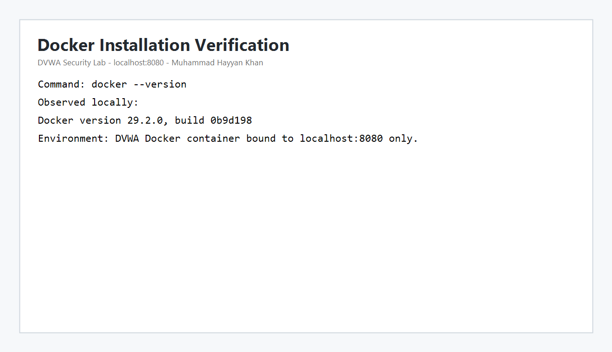

### 1.2 Pulling and Running DVWA

```bash
docker pull vulnerables/web-dvwa

docker run -d \
  --name dvwa \
  -p 8080:80 \
  vulnerables/web-dvwa

docker ps
```

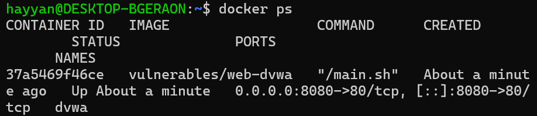

### 1.3 Accessing DVWA

DVWA was opened at:

```text
http://localhost:8080
```

The database was created/reset from the setup page, then DVWA was accessed with the default lab credentials:

```text
Username: admin
Password: password
```

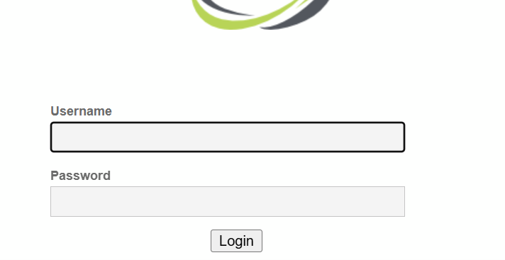

## 2. SQL Injection

SQL Injection manipulates database queries by injecting SQL through user-controlled input. At weak security levels, this changes the query logic and returns data that should not be returned.

| Security Level | Payload / Method | Result | Explanation | Screenshot |
|---|---|---|---|---|
| Low | `1' OR '1'='1` | All users were returned. | The application concatenates input directly into the SQL query, so the always-true OR condition bypasses the intended `WHERE` filter. | 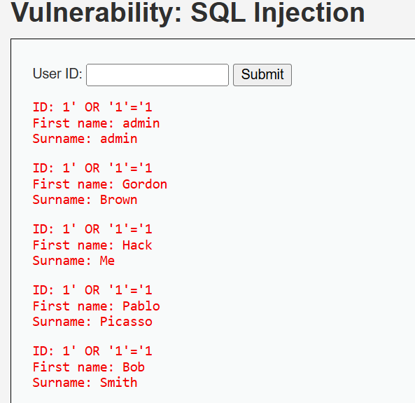 |
| Medium | `1 OR 1=1` via edited dropdown value | Attack partially succeeded. | Quote escaping blocks quote-based payloads, but unquoted integer SQL logic still changes the query. | 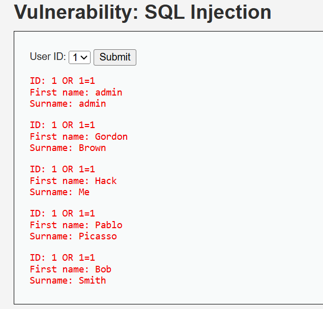 |
| High | `1' OR '1'='1` | Attack failed. | Prepared statements bind the value as data, so input cannot alter SQL syntax. | 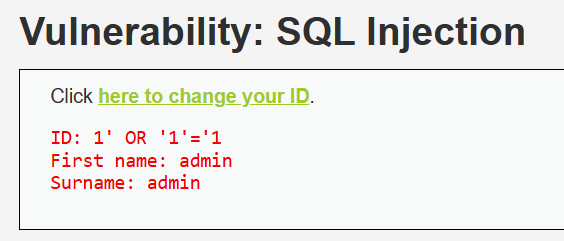 |

Vulnerable low-level query pattern:

```php
$query = "SELECT first_name, last_name FROM users WHERE user_id = '$id';";
```

The low payload changes the query into logic equivalent to:

```sql
SELECT first_name, last_name FROM users WHERE user_id = '1' OR '1'='1';
```

## 3. SQL Injection Blind

Blind SQL Injection does not directly print database records. Instead, the attacker asks true/false questions and compares the page response.

| Security Level | Payload / Method | Result | Explanation | Screenshot |
|---|---|---|---|---|
| Low | `1' AND '1'='1` and `1' AND '1'='2` | The page returned different messages for true and false conditions. | Direct query concatenation allows boolean SQL conditions to affect the response. | 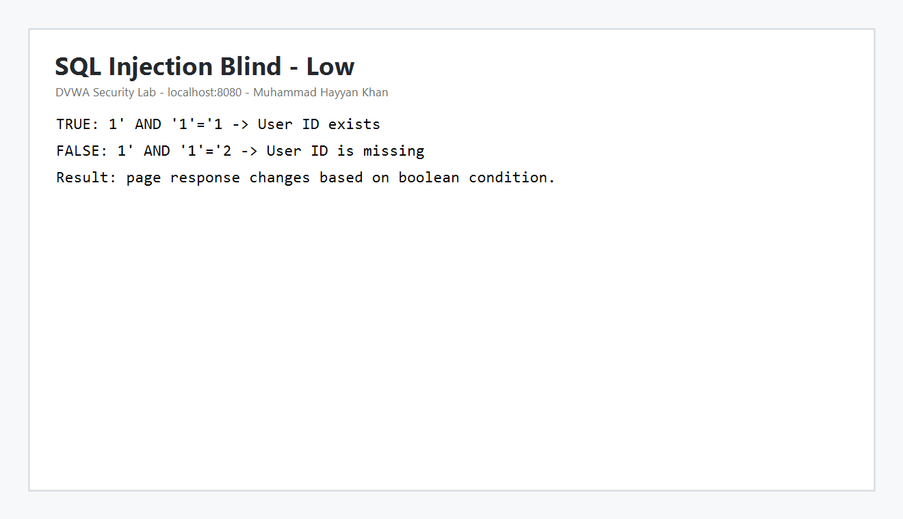 |
| Medium | `1 AND 1=1` and `1 AND 1=2` via dropdown edit | Still worked. | Numeric injection bypasses quote escaping because it does not require quotes. |  |
| High | `1' AND '1'='1` and `1' AND '1'='2` | Attack failed. | Parameter binding prevents injected boolean logic from becoming part of the SQL statement. | 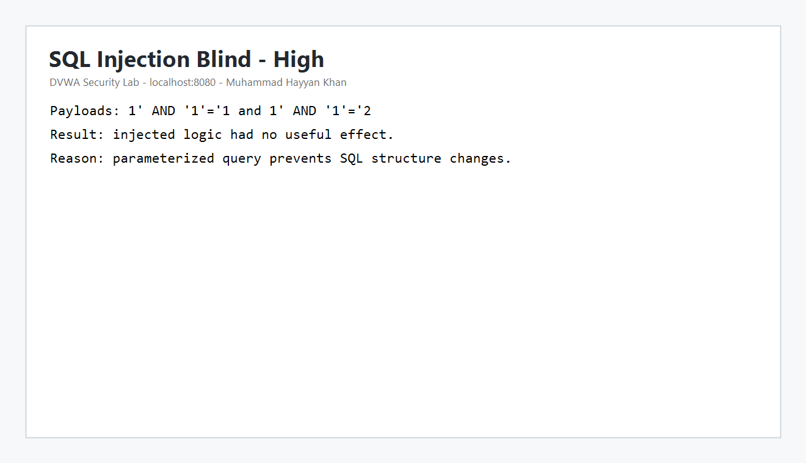 |

## 4. XSS Reflected

Reflected XSS occurs when input is immediately included in the response without safe output encoding, causing the browser to execute attacker-supplied JavaScript.

| Security Level | Payload / Method | Result | Explanation | Screenshot |
|---|---|---|---|---|
| Low | `<script>alert('XSS')</script>` | Alert popup executed. | Input is echoed directly into HTML. | 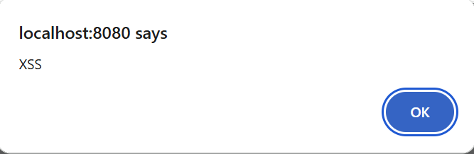 |
| Medium | `<Script>alert('XSS')</Script>` | Alert popup executed. | The blacklist strips lowercase `<script>` only, so mixed case bypasses it. | 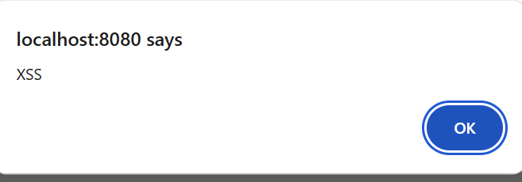 |
| High | `<script>alert('XSS')</script>` and `` | No popup; code displayed as text. | `htmlspecialchars()` encodes HTML metacharacters before output. | 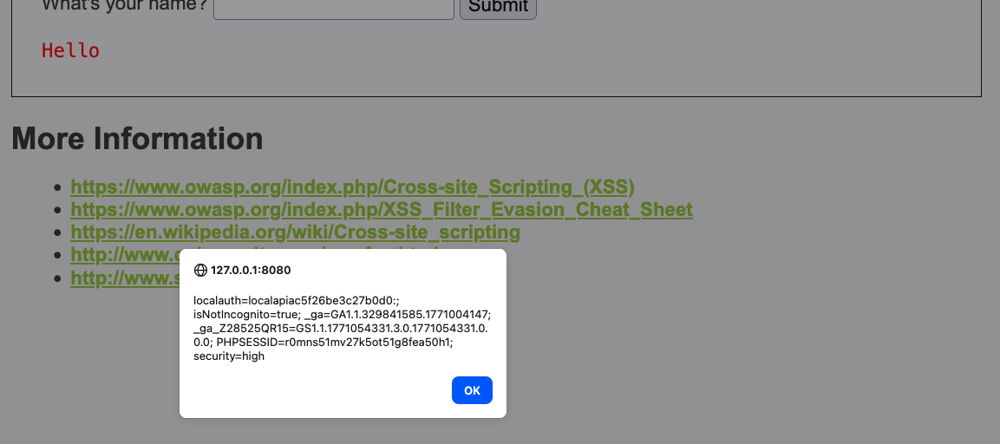 |

Low-level vulnerable output pattern:

```php
echo '<pre>Hello ' . $_GET['name'] . '</pre>';
```

## 5. XSS Stored

Stored XSS persists malicious input in the database. Any user who views the affected page can trigger the script.

| Security Level | Payload / Method | Result | Explanation | Screenshot |
|---|---|---|---|---|
| Low | Message: `<script>alert('Stored XSS')</script>` | Alert fired and persisted in the guestbook. | Input is stored and rendered without sanitization or output encoding. | 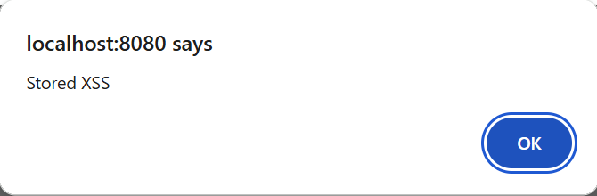 |
| Medium | Name: `` after extending `maxlength` | Alert executed. | The filter targets script tags but not event-handler attributes. | 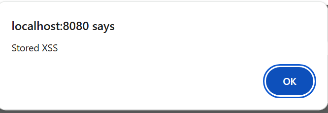 |
| High | `` | Message field was protected; any unprotected field remains a risk. | Security controls must be applied uniformly to every output context. | 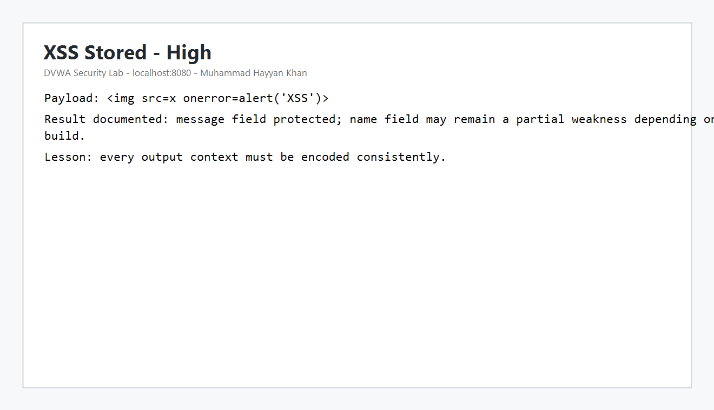 |

## 6. XSS DOM

DOM-based XSS happens in the browser. The server may never receive the payload; vulnerable client-side JavaScript reads from the URL and writes unsafe content into the DOM.

| Security Level | Payload / Method | Result | Explanation | Screenshot |
|---|---|---|---|---|
| Low | `?default=<script>alert('DOM XSS')</script>` | Alert executed. | URL input is written into the DOM without encoding. | 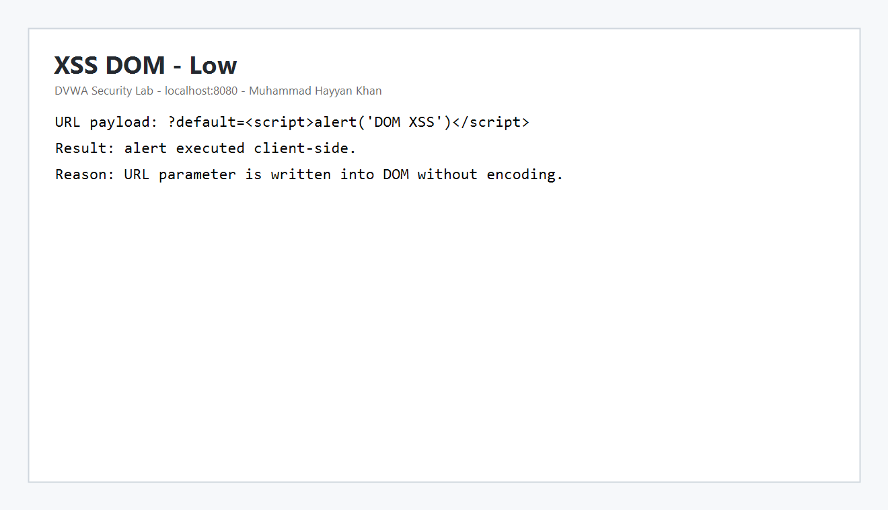 |
| Medium | `English</option></select>` | Alert executed. | The payload escapes the dropdown context and injects an image event handler. | 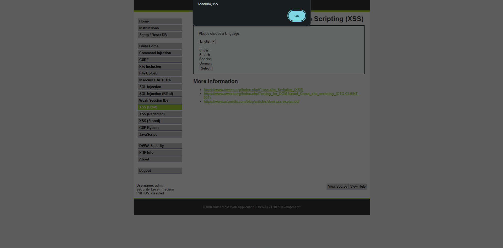 |
| High | `<script>alert('XSS')</script>` | No popup. | A whitelist accepts only known language values such as English, French, Spanish, and German. | 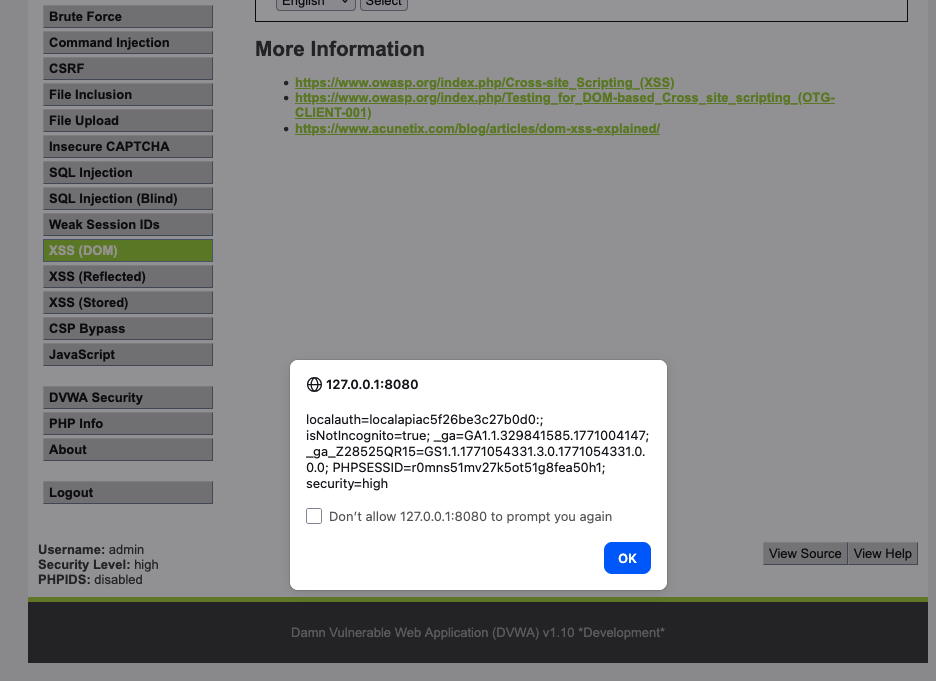 |

## 7. Command Injection

Command Injection appends operating system commands to a server-side command, such as a ping operation.

| Security Level | Payload / Method | Result | Explanation | Screenshot |
|---|---|---|---|---|
| Low | `127.0.0.1; ls /var/www/html` | Ping output plus web directory listing. | Input is passed directly into shell execution. | 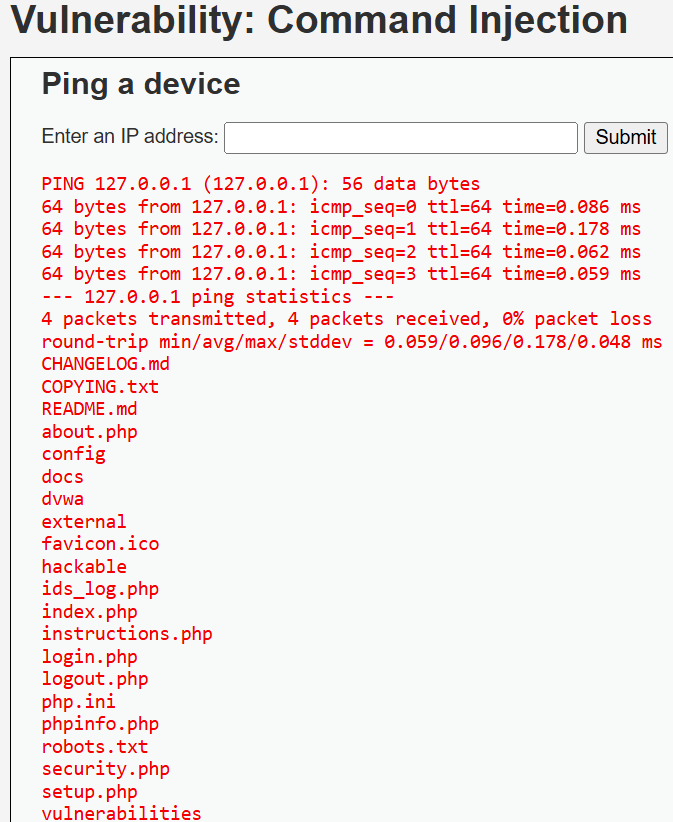 |
| Medium | `127.0.0.1 | ls` | Directory listing appeared. | The blacklist blocks some separators but misses the pipe character. | 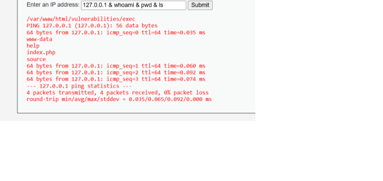 |
| High | `127.0.0.1; ls`, `127.0.0.1 | ls`, `127.0.0.1 && ls` | Only normal ping output returned. | Shell metacharacters are stripped or escaped before execution. | 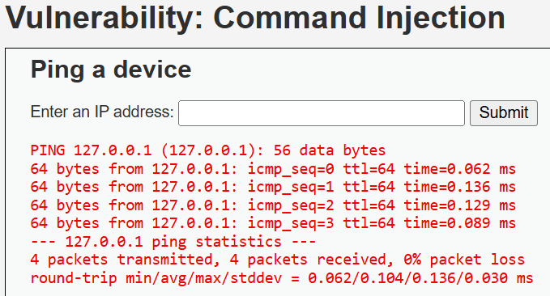 |

Low-level vulnerable pattern:

```php
shell_exec('ping -c 4 ' . $target);
```

## 8. CSRF

CSRF tricks an authenticated browser into submitting a request the user did not intend to make. The browser automatically includes valid session cookies.

| Security Level | Payload / Method | Result | Explanation | Screenshot |
|---|---|---|---|---|
| Low | Auto-submitting HTML form changing the password to `hacked123` | Password changed without user interaction. | No CSRF token is required. | 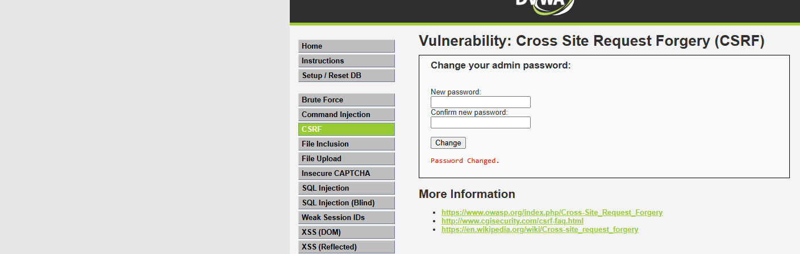 |
| Medium | Same HTML attack file | Basic attack failed. | DVWA checks the HTTP Referer header. | 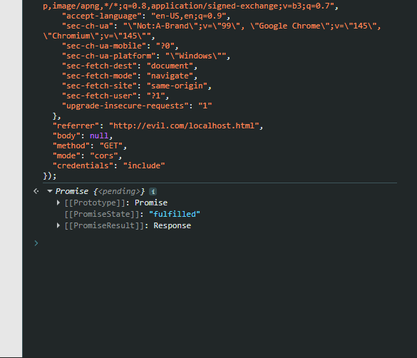 |
| High | Forged request without a valid `user_token` | Rejected. | A unique unpredictable token is embedded and validated server-side. | 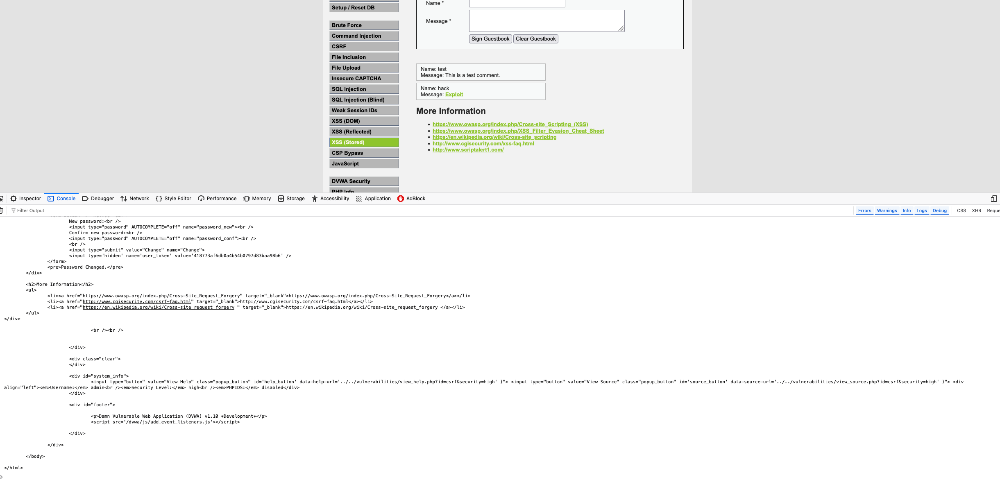 |

Example low-level attack page:

```html
<html>
  <body onload="document.forms[0].submit()">
    <form action="http://localhost:8080/vulnerabilities/csrf/" method="GET">
      <input type="hidden" name="password_new" value="hacked123" />
      <input type="hidden" name="password_conf" value="hacked123" />
      <input type="hidden" name="Change" value="Change" />
    </form>
  </body>
</html>
```

## 9. File Inclusion

File Inclusion allows an attacker to control which file the server includes through a URL parameter.

| Security Level | Payload / Method | Result | Explanation | Screenshot |
|---|---|---|---|---|
| Low | `?page=../../../../../../etc/passwd` | `/etc/passwd` displayed. | The server includes the user-supplied path directly. | 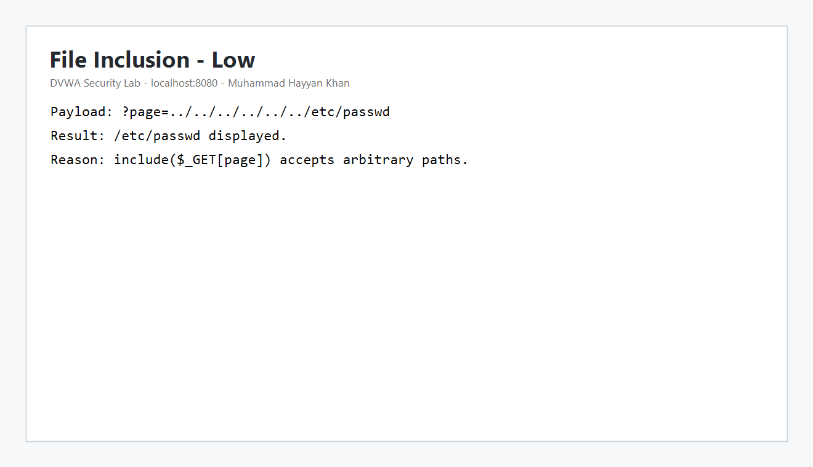 |
| Medium | `?page=....//....//....//....//etc/passwd` | Traversal bypass still worked. | The filter strips `../` once, allowing reconstructed traversal. |  |
| High | `?page=../../../../../../etc/passwd` | Rejected. | A strict whitelist permits only known safe filenames. |  |

Vulnerable low-level pattern:

```php
include($_GET['page']);
```

## 10. File Upload

Unrestricted upload can allow a PHP command wrapper to be placed in a public web directory, leading to remote command execution in the lab container.

| Security Level | Payload / Method | Result | Explanation | Screenshot |
|---|---|---|---|---|
| Low | Upload `shell.php` containing a PHP command execution wrapper | Command execution confirmed with `cmd=id`. | No file type validation is performed. | 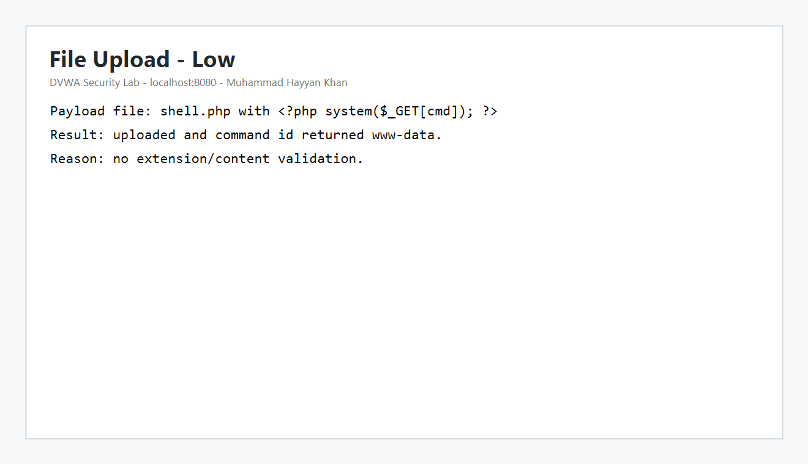 |
| Medium | Spoof upload `Content-Type` as `image/jpeg` | PHP file uploaded. | The server trusts a client-controlled MIME header. | 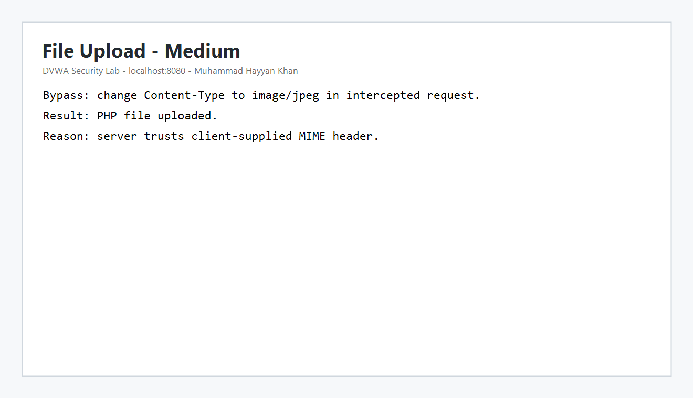 |
| High | Upload PHP file, even with spoofed MIME type | Rejected. | `getimagesize()` checks actual image content. | 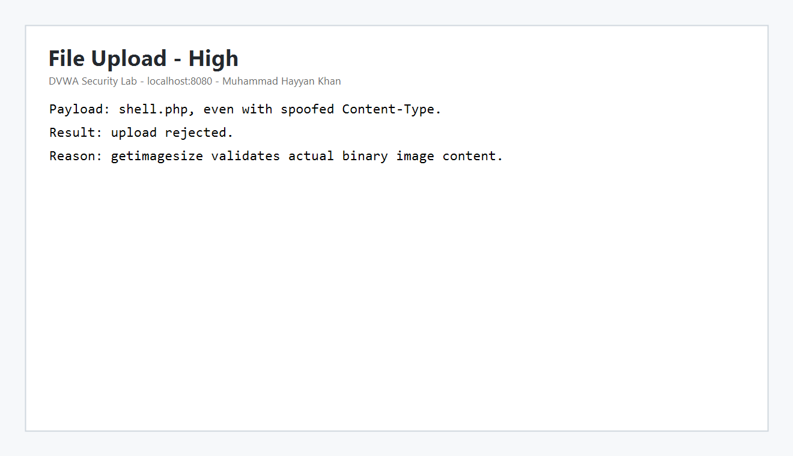 |

For safety, the exact web-shell one-liner is documented in lab notes only and is not stored as an executable file in this repository.

## 11. Brute Force

Brute force attacks automate credential guessing until a valid username and password pair is found.

| Security Level | Payload / Method | Result | Explanation | Screenshot |
|---|---|---|---|---|
| Low | Hydra with username `admin` and `rockyou.txt` | Password `password` found quickly. | No rate limiting, lockout, CAPTCHA, or per-request token. | 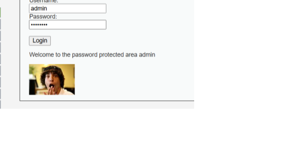 |
| Medium | Same Hydra attack with `security=medium` | Still found password, but slower. | `sleep(2)` delays attempts but does not stop automation. | 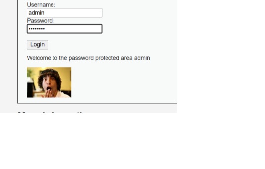 |
| High | Same Hydra pattern with `security=high` | Failed. | Fresh CSRF tokens are required for each attempt. | 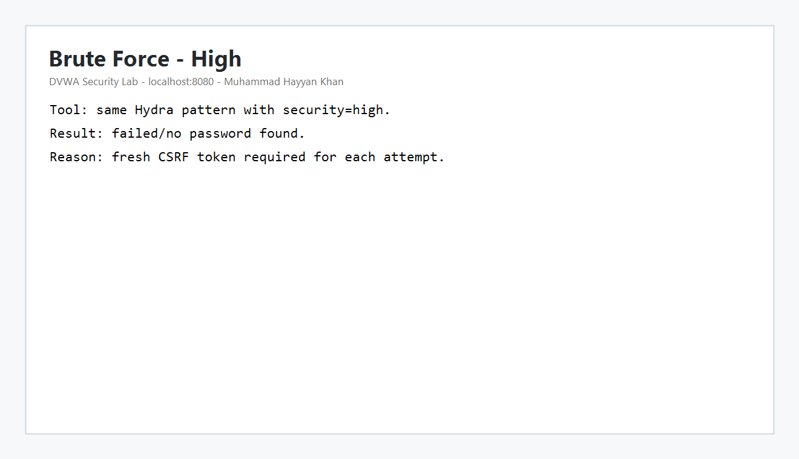 |

Hydra command pattern:

```bash
hydra -l admin -P /usr/share/wordlists/rockyou.txt localhost \
http-get-form "/vulnerabilities/brute/:username=^USER^&password=^PASS^&Login=Login:Username and/or password incorrect.:H=Cookie: PHPSESSID=YOUR_PHPSESSID; security=low" -V -f
```

## 12. Insecure CAPTCHA

The insecure CAPTCHA module shows why the server must verify CAPTCHA results itself instead of trusting client-supplied form parameters.

| Security Level | Payload / Method | Result | Explanation | Screenshot |
|---|---|---|---|---|
| Low | Change `step=1` to `step=2` | Password changed. | The server trusts the client-reported step. | 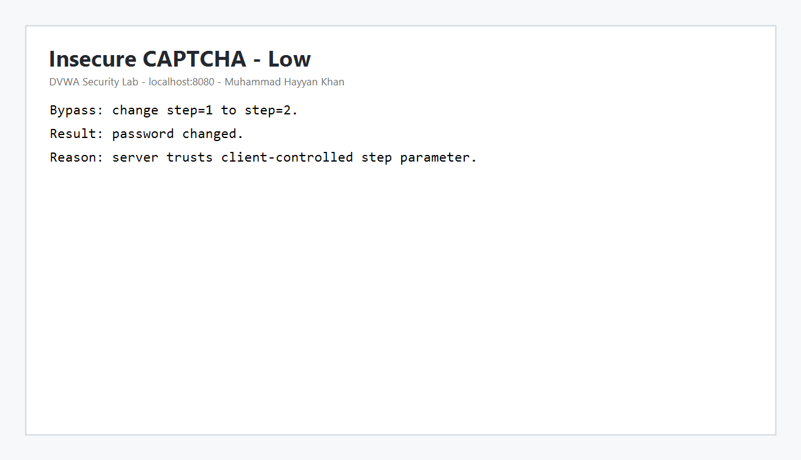 |
| Medium | Add `passed_captcha=true` | Password changed. | The server checks for a fakeable parameter. |  |
| High | Modify client parameters | Failed. | CAPTCHA is verified server-side with the provider. | 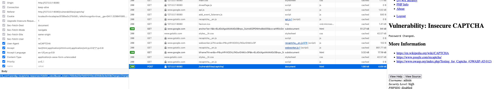 |

## 13. Weak Session IDs

Session IDs must be unpredictable. Predictable session IDs can allow session hijacking.

| Security Level | Payload / Method | Result | Explanation | Screenshot |
|---|---|---|---|---|
| Low | Generate multiple `dvwaSession` cookies | Values incremented as `1`, `2`, `3`, `4`. | Sequential IDs are easily guessable. |  |
| Medium | Generate multiple `dvwaSession` cookies | Values were Unix timestamps. | Time-based IDs are guessable within a small window. | 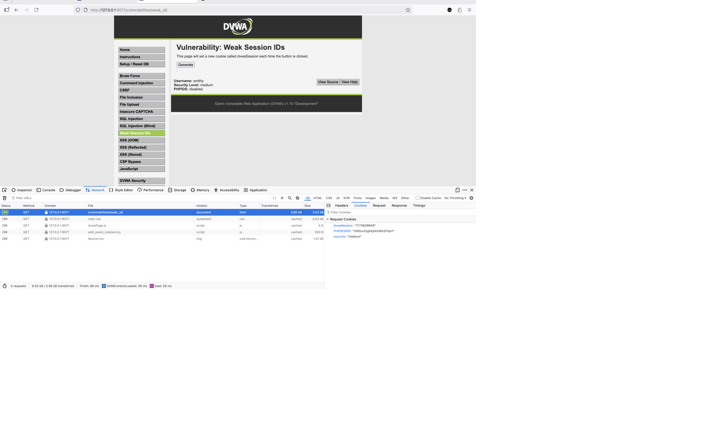 |
| High | Generate multiple `dvwaSession` cookies | Long MD5-style values. | Random values have no practical predictable pattern. | 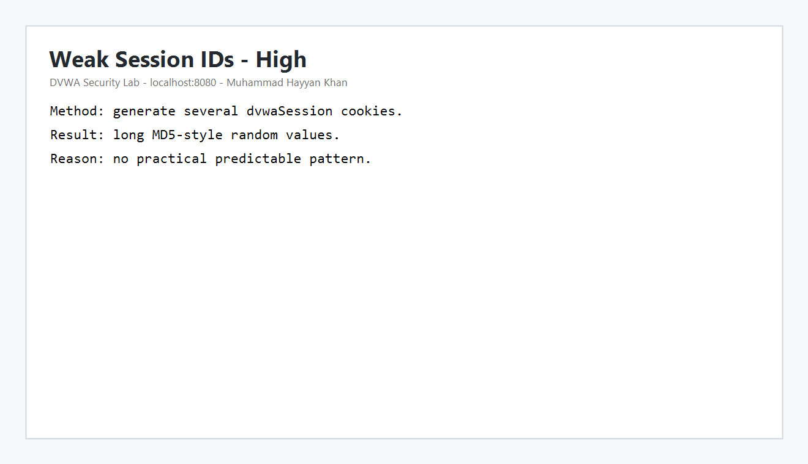 |

## 14. CSP Bypass

Content Security Policy controls which scripts a browser is allowed to execute. A weak or misconfigured CSP can still allow attacker-controlled scripts.

| Security Level | Payload / Method | Result | Explanation | Screenshot |
|---|---|---|---|---|
| Low | Include a script from a trusted Pastebin raw URL | Alert executed. | CSP trusts a public user-content domain. | 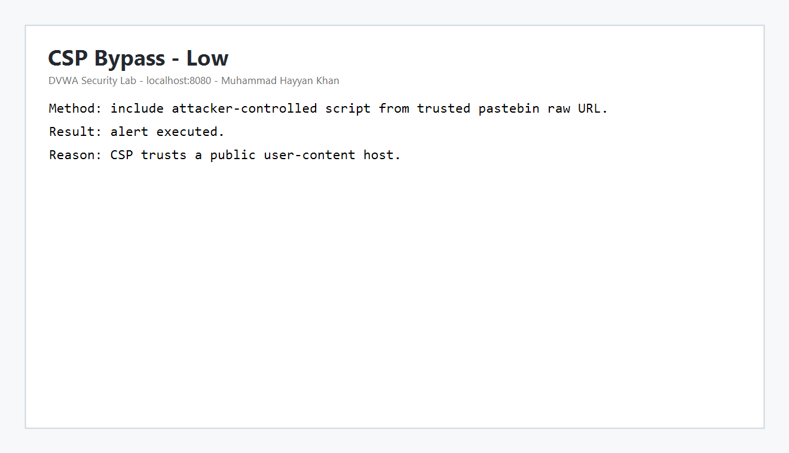 |
| Medium | Reuse static nonce from page source | Alert executed. | A nonce must be random and single-use; a hardcoded nonce is reusable. | 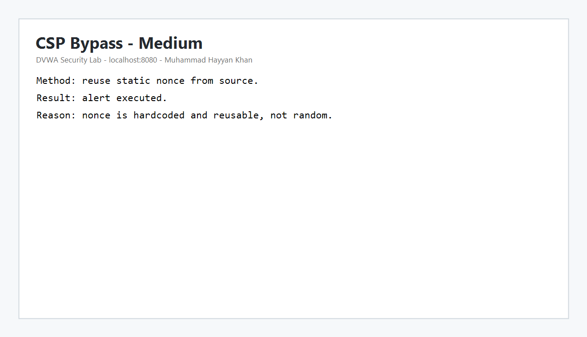 |
| High | Attempt inline/external script injection | Blocked with CSP violation. | A random nonce is generated each page load. | 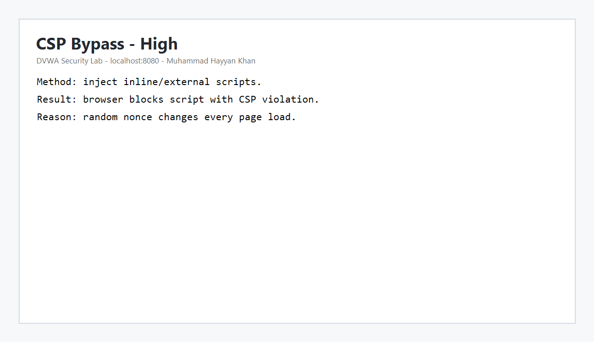 |

## 15. JavaScript

This module demonstrates why security decisions should not depend only on client-side JavaScript. Any code running in the browser can be inspected and reproduced.

| Security Level | Payload / Method | Result | Explanation | Screenshot |
|---|---|---|---|---|
| Low | Set phrase to `success` and token to `md5("XXsuccessXX")` | Well done message appeared. | Token generation logic is visible in page source. | 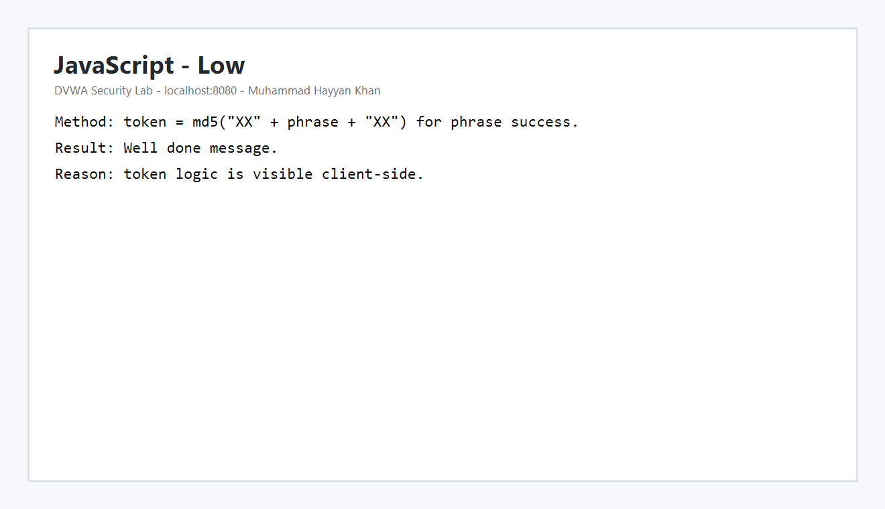 |
| Medium | Replace `eval(` with `console.log(` to reveal obfuscated code | Token forged successfully. | Obfuscation slows reading but does not protect logic. | 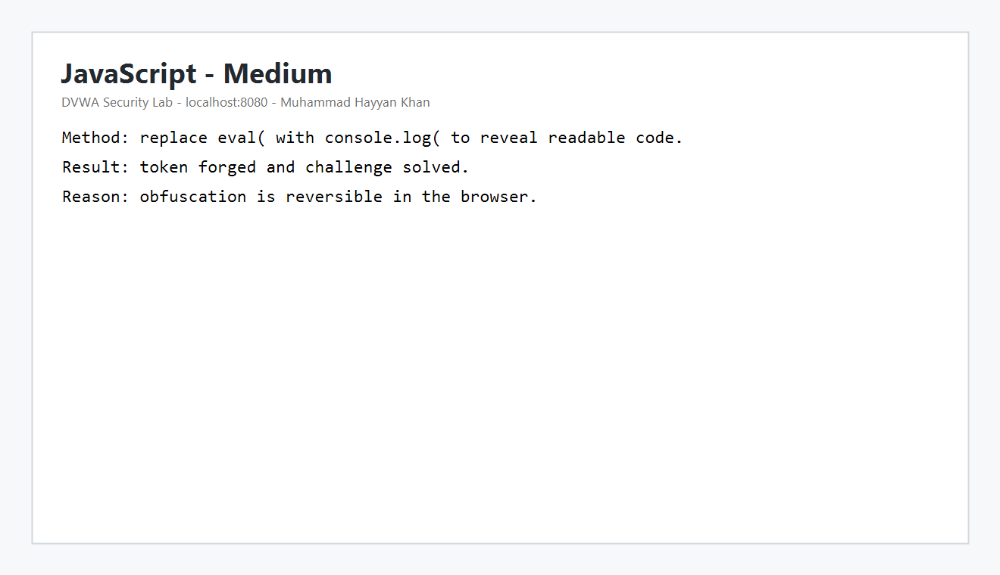 |
| High | Pretty-print external minified JavaScript and reproduce algorithm | Correct token accepted. | Client-side algorithms remain inspectable. | 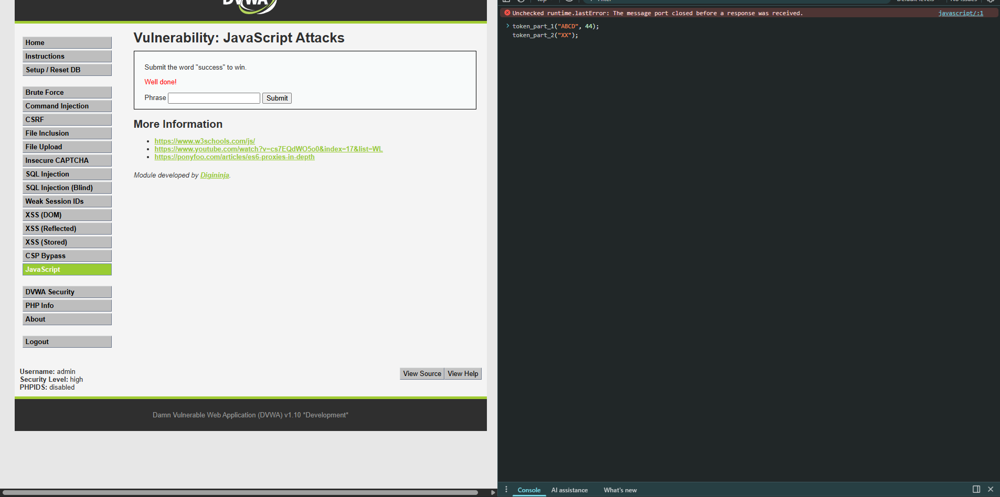 |

Console method used at low level:

```javascript
document.getElementById("token").value = md5("XXsuccessXX");
document.getElementById("phrase").value = "success";
document.getElementById("send").click();
```

## 16. Docker Inspection

### 16.1 docker ps

```bash
docker ps
```


### 16.2 docker inspect dvwa

```bash
docker inspect dvwa
```

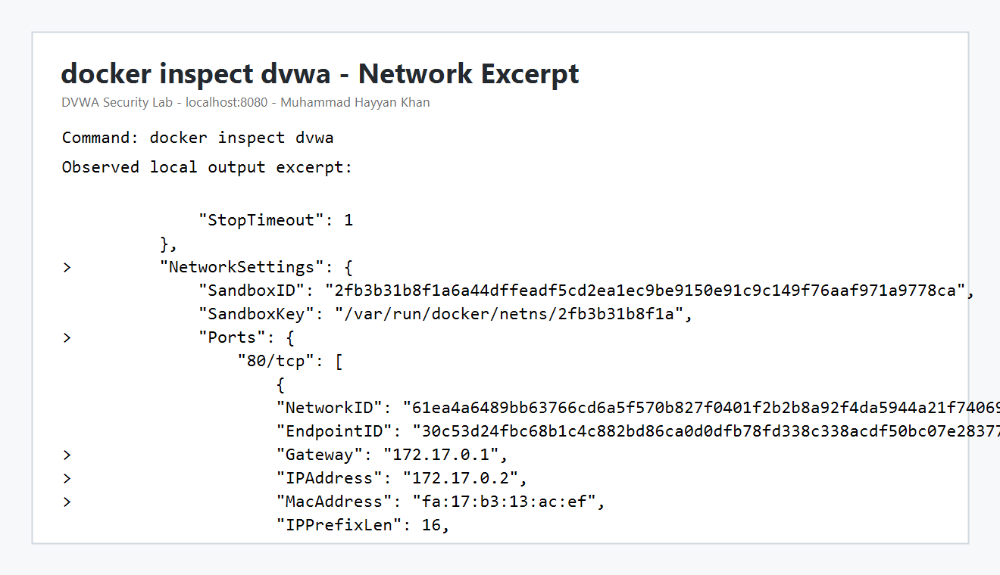

### 16.3 docker logs dvwa

```bash
docker logs dvwa
```

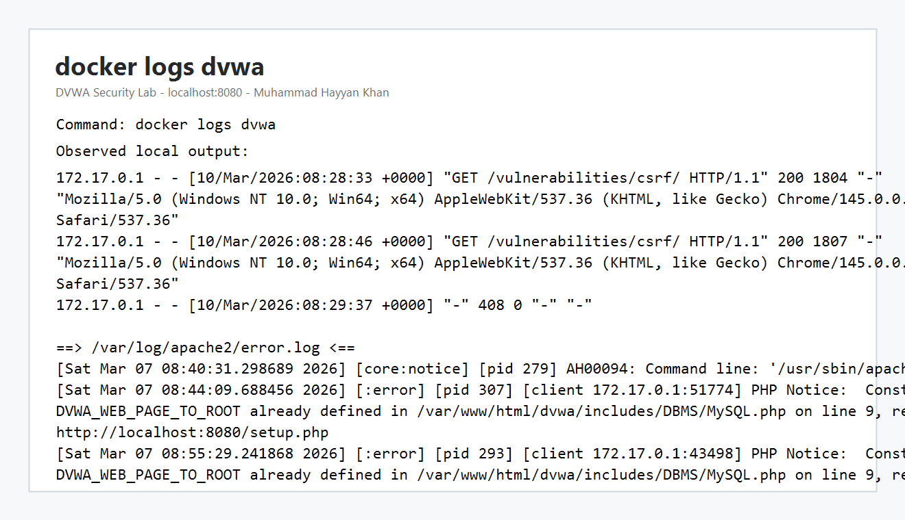

### 16.4 Inside the Container

```bash
docker exec -it dvwa /bin/bash
ls /var/www/html
exit
```

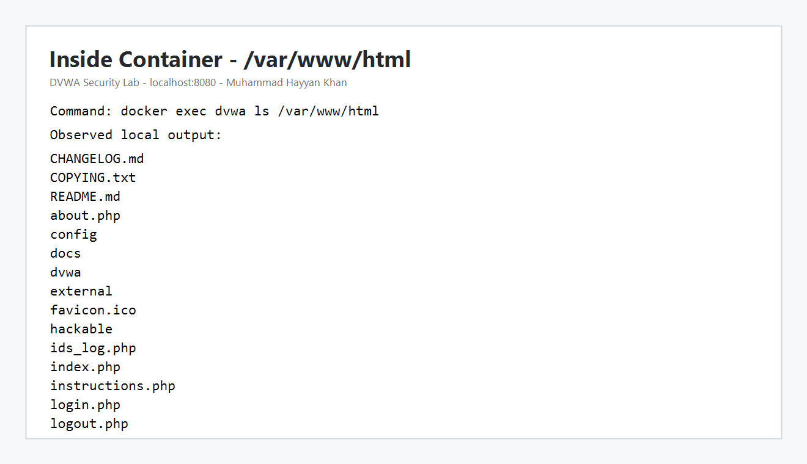

### 16.5 Docker Analysis

| Question | Answer |
|---|---|
| Where are application files stored? | `/var/www/html`, served by Apache inside the container. |
| Backend technology | PHP + Apache2 + MySQL/MariaDB. |
| How Docker isolates the environment | Docker uses Linux namespaces for process, network, mount, and IPC isolation, plus cgroups for resource limits. The container has its own filesystem and private bridge-network IP. Host port `8080` maps to container port `80`, keeping the lab local. |

## 17. Security Analysis

### Q1: Why does SQL Injection succeed at Low security?

SQL Injection succeeds because Low security directly concatenates user input into SQL queries. The database receives attacker-controlled SQL syntax instead of a simple user ID.

### Q2: What control prevents it at High?

Prepared statements with parameterized queries prevent SQL Injection. The SQL structure is compiled first, then user input is bound as data. Characters such as quotes or SQL keywords cannot change the query logic.

### Q3: Does HTTPS prevent these attacks?

No. HTTPS encrypts traffic in transit, but these vulnerabilities happen in the application after the request reaches the server. HTTPS protects confidentiality and integrity on the network; it does not fix SQL Injection, XSS, CSRF, insecure upload handling, or command execution flaws.

### Q4: What risks exist if DVWA is deployed publicly?

| Risk | Impact |
|---|---|
| File Upload RCE | Full web server compromise. |
| SQL Injection | Database dumping, credential theft, data modification. |
| Command Injection | Operating-system command execution and internal network pivoting. |
| Stored XSS | Session theft and attacks against every visitor. |
| CSRF | Unauthorized account actions. |
| File Inclusion | Sensitive file disclosure and possible code execution. |
| Brute Force | Account takeover at scale. |
| Weak Session IDs | Session hijacking without credentials. |

## 18. OWASP Top 10 Mapping

| Vulnerability | OWASP Top 10 2021 Category |
|---|---|
| SQL Injection | A03:2021 - Injection |
| SQL Injection Blind | A03:2021 - Injection |
| XSS Reflected | A03:2021 - Injection |
| XSS Stored | A03:2021 - Injection |
| XSS DOM | A03:2021 - Injection |
| Command Injection | A03:2021 - Injection |
| CSRF | A01:2021 - Broken Access Control |
| File Inclusion | A05:2021 - Security Misconfiguration |
| File Upload | A04:2021 - Insecure Design |
| Brute Force | A07:2021 - Identification and Authentication Failures |
| Insecure CAPTCHA | A07:2021 - Identification and Authentication Failures |
| Weak Session IDs | A07:2021 - Identification and Authentication Failures |
| CSP Bypass | A05:2021 - Security Misconfiguration |
| JavaScript | A04:2021 - Insecure Design |

## 19. Bonus: Nginx + HTTPS

### Architecture

```text
Browser (HTTPS :443)
        |
        v
   Nginx Container  <-- self-signed TLS certificate
        |
        v
   DVWA Container (:80, internal only)
```

### Step 1: Stop Existing Container

```bash
docker stop dvwa
docker rm dvwa
```

### Step 2: Create Folder and Certificate

```bash
mkdir -p ~/dvwa-nginx/certs
cd ~/dvwa-nginx

openssl req -x509 -nodes -days 365 \
  -newkey rsa:2048 \
  -keyout certs/dvwa.key \
  -out certs/dvwa.crt \
  -subj "/CN=localhost/O=DVWALab/C=US"
```

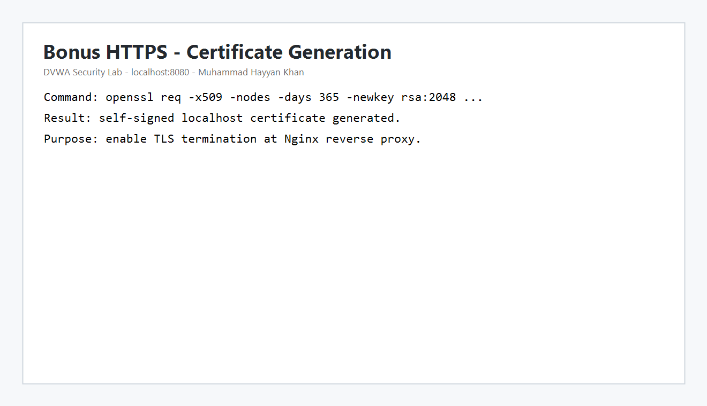

### Step 3: nginx.conf

```nginx
events {}

http {
    server {
        listen 80;
        server_name localhost;
        return 301 https://$host$request_uri;
    }

    server {
        listen 443 ssl;
        server_name localhost;

        ssl_certificate     /etc/nginx/certs/dvwa.crt;
        ssl_certificate_key /etc/nginx/certs/dvwa.key;
        ssl_protocols       TLSv1.2 TLSv1.3;

        location / {
            proxy_pass         http://dvwa:80;
            proxy_set_header   Host $host;
            proxy_set_header   X-Real-IP $remote_addr;
            proxy_set_header   X-Forwarded-For $proxy_add_x_forwarded_for;
            proxy_set_header   X-Forwarded-Proto $scheme;
        }
    }
}
```

### Step 4: docker-compose.yml

```yaml
version: "3.8"

services:
  dvwa:
    image: vulnerables/web-dvwa
    container_name: dvwa
    networks:
      - lab-net

  nginx:
    image: nginx:alpine
    container_name: nginx-proxy
    ports:
      - "80:80"
      - "443:443"
    volumes:
      - ./nginx.conf:/etc/nginx/nginx.conf:ro
      - ./certs:/etc/nginx/certs:ro
    depends_on:
      - dvwa
    networks:
      - lab-net

networks:
  lab-net:
    driver: bridge
```

### Step 5: Launch and Test

```bash
docker compose up -d
docker ps
```

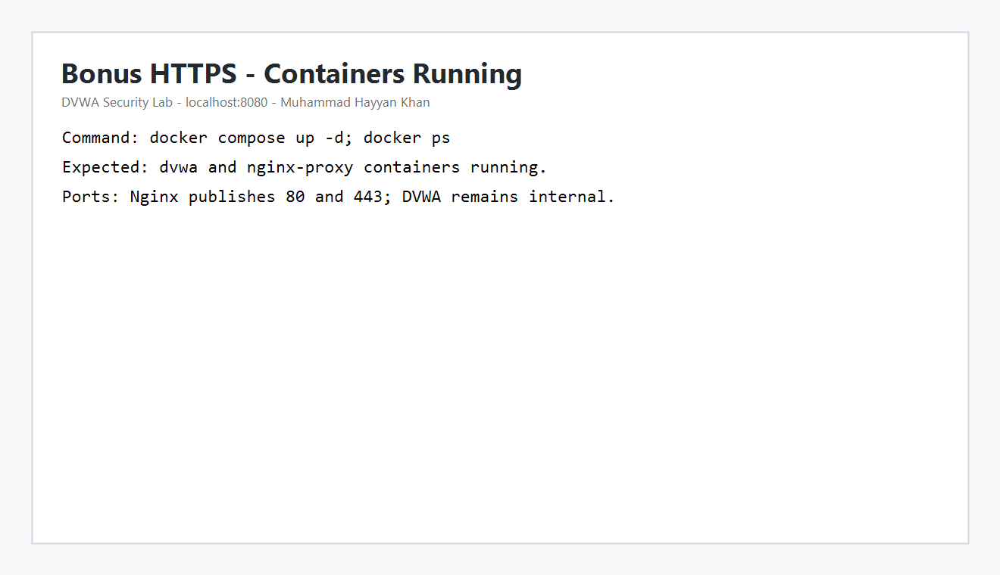

Access DVWA through HTTPS:

```text
https://localhost
```

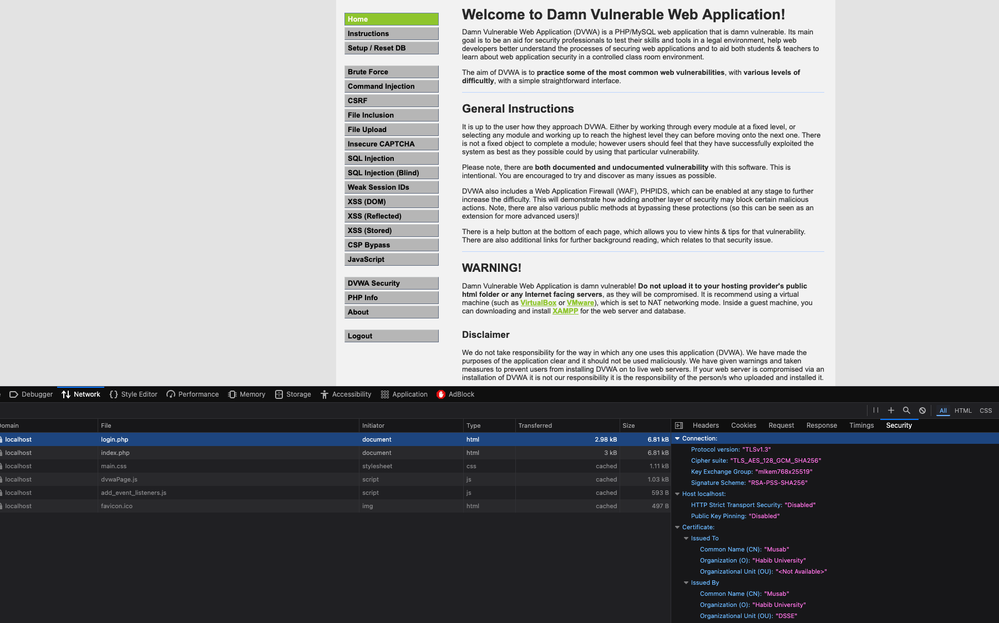

Test HTTP redirect:

```text
http://localhost
```

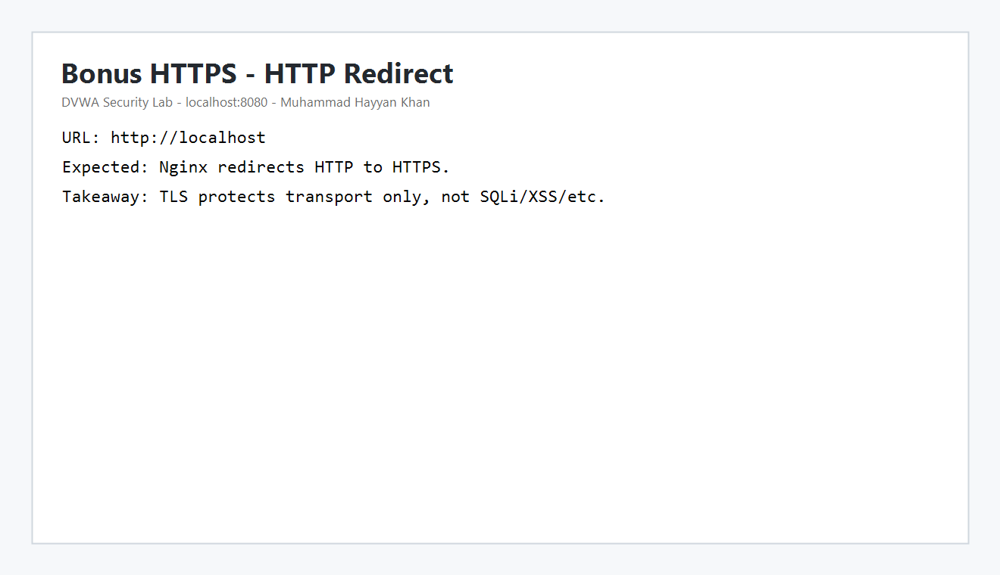

### HTTP vs HTTPS Comparison

| Aspect | HTTP | HTTPS |
|---|---|---|
| Transport | Plaintext | TLS encrypted |
| Credentials visible to network attacker | Yes | No |
| Session cookies sniffable | Yes | No, if Secure cookies and proper TLS are used |
| Protects against SQLi/XSS | No | No |
| Man-in-the-middle risk | Trivial | Blocked when certificate is trusted |

Key takeaway: HTTPS protects data in transit. It does not repair application-layer vulnerabilities. Secure transport and secure application code are both required.

## 20. Summary Table

| # | Vulnerability | Low | Medium | High |
|---|---|---|---|---|
| 1 | SQL Injection | Exploited | Partial | Blocked |
| 2 | SQL Injection Blind | Exploited | Partial | Blocked |
| 3 | XSS Reflected | Exploited | Partial | Blocked |
| 4 | XSS Stored | Exploited | Partial | Partial/depends on field handling |
| 5 | XSS DOM | Exploited | Partial | Blocked |
| 6 | Command Injection | Exploited | Partial | Blocked |
| 7 | CSRF | Exploited | Partial | Blocked |
| 8 | File Inclusion | Exploited | Partial | Blocked |
| 9 | File Upload | Exploited | Partial | Blocked |
| 10 | Brute Force | Exploited | Slowed | Blocked |
| 11 | Insecure CAPTCHA | Exploited | Partial | Blocked |
| 12 | Weak Session IDs | Predictable | Weak | Secure |
| 13 | CSP Bypass | Exploited | Partial | Blocked |
| 14 | JavaScript | Solved | Bypassed | Bypassable with reverse engineering |

## Submission Link

Repository:

```text
https://github.com/Hayyankhan2/dvwa-security-lab
```

